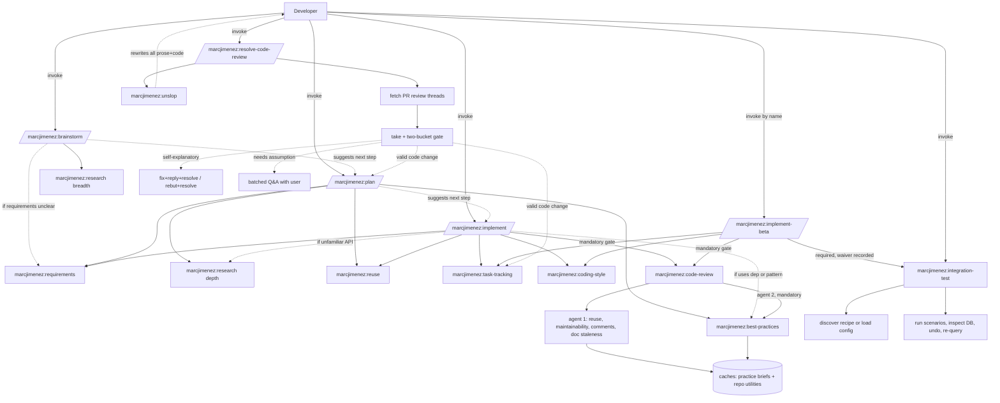

# marcjimenez Skills Plugin

A composable, opinionated development workflow for Claude Code featuring research-backed planning, code minimalism discipline, and a code review that hunts reuse and maintainability rather than repeating what the PR bot already said.

## Overview

The `marcjimenez` plugin provides a full-cycle development workflow built on a two-tier architecture:

- **Orchestrators** (user-invoked): High-level workflows that compose primitives into complete development cycles
- **Primitives** (auto-invoked): Focused discipline skills that enforce quality gates and best practices

All configuration and artifacts are stored in a cross-platform directory outside your repositories, ensuring clean separation between tooling and source code.

## Skills Reference

### Orchestrators

`brainstorm` and `setup` are entry points: nothing hands off to them, so they carry
`disable-model-invocation` and run only when you type them. `implement-beta` carries it for a different
reason: it would otherwise compete with `implement` for the same triggers. `plan` and `implement` are
chained into after you approve the step before, so they must stay model-invokable or the handoff errors.

| Command | Invocation | Purpose |
|---------|-----------|---------|
| `/marcjimenez:plan` | auto | Produces research-backed implementation plans with concrete code examples and task breakdowns |
| `/marcjimenez:brainstorm` | user only | Explores 2-4 solution approaches with tradeoffs before committing to a direction |
| `/marcjimenez:implement` | auto | Executes full build cycle: branch creation, requirements gathering, task tracking, implementation, verification, code review, and PR creation |
| `/marcjimenez:implement-beta` | user only | Opt-in trial of the build cycle with a required end-to-end verification phase before code review |
| `/marcjimenez:setup` | user only | Configures external connections, API keys, code review settings, VCS settings, and default preferences |

### Primitives (Auto-Invoked)

| Skill | Trigger Condition |
|-------|------------------|
| `marcjimenez:research` | Before implementing against unfamiliar APIs or libraries; gathers GitHub examples, official documentation, and best practices |
| `marcjimenez:best-practices` | During planning, implementation, and review; audits the approach against real-world GitHub patterns and flags divergences with citations |
| `marcjimenez:requirements` | When build/fix/refactor requests are vague or underspecified; grills requirements to zero ambiguity |
| `marcjimenez:reuse` | Before writing new functions, helpers, or adding dependencies; enforces the Climb-the-Ladder reuse doctrine |
| `marcjimenez:coding-style` | Before writing or editing non-trivial code; enforces ponytail minimalism and root-cause bug fixes |
| `marcjimenez:writing-for-agents` | When creating SKILL.md, CLAUDE.md, or other agent-facing documentation |
| `marcjimenez:integration-test` | After unit tests and lint are green, before code review; starts the services, fetches a token, runs the real calls, inspects the database rows, then undoes them and proves the undo |
| `marcjimenez:code-review` | After completing implementation, before git push or PR creation; two agents audit the local diff for reuse, maintainability and comment discipline, and against the tech stack's own docs |
| `marcjimenez:resolve-code-review` | After a PR has review comments; fetches every thread, states a take, resolves the self-explanatory ones autonomously, and batches the rest into a single Q&A session |
| `marcjimenez:unslop` | Whenever writing or editing prose or non-trivial code; removes AI-slop tells by density and rewrites to plain natural language, rejecting both slop and clipped over-correction |
| `marcjimenez:task-tracking` | When starting multi-step work; maintains durable task file with verifiable completion criteria |
| `marcjimenez:issue` | When creating or filing a GitHub issue; learns the repo's labeling conventions, drafts the body in its idiom, and applies the ready label when the ticket passes the agent-readiness gate |

The `implement` orchestrator hard-gates code review before any push, so nothing leaves your machine unreviewed.

`implement-beta` is a time-boxed trial of that same cycle with an added end-to-end phase, and it never auto-triggers: invoke it by name. Promotion over `implement` is gated on three green runs across two or more repos, one prod run whose cleanup was proven by re-query, one discovery run that derived a working recipe unaided, and one waiver run on a diff with no runtime surface.

## Architecture



## Installation

### 1. Add Marketplace

Add the skills marketplace to `~/.claude/settings.json`:

```json
{
  "extraKnownMarketplaces": {
    "marcjimenez-skills": {
      "source": { "source": "github", "repo": "marcjimenez/skills" }
    }
  }
}
```

### 2. Enable Plugin

Enable per-project in `.claude/settings.json`:

```json
{
  "enabledPlugins": { "marcjimenez@marcjimenez-skills": true }
}
```

### 3. Verify Installation

Run `/skills` in Claude Code and verify that 17 `marcjimenez:*` skills appear in the list.

## Configuration

Configuration and artifacts are stored in a cross-platform directory structure outside your repositories:

**Configuration Home:**
- macOS / Linux: `${XDG_CONFIG_HOME:-$HOME/.config}/marcjimenez`
- Windows: `%APPDATA%\marcjimenez`

**Directory Structure:**
```
<config-home>/
├── global/
│   └── config.json              # Global default settings (written by /marcjimenez:setup)
├── practices/
│   └── <technology>.md          # What a technology says about using it well, and what it ships
├── repos/
│   └── marcjimenez-skills/      # owner-repo from the origin remote, shared by every worktree
│       ├── config.json          # Per-repository overrides
│       ├── utilities.md         # This repo's reusable helpers, indexed by code review
│       └── runs/
│           └── <feature-slug>/
│               ├── research.md  # Research findings
│               ├── plan.md      # Implementation plan
│               ├── todo.md      # Task tracking file
│               ├── review.md    # Per-unit review checklist and verdicts
│               └── integration.md  # End-to-end run evidence and cleanup proof
└── secrets.env                  # API keys (chmod 600, never committed)
```

**Configuration Precedence:**
Inline arguments → Per-repository config → Global config → Built-in defaults

### Initial Setup

Run `/marcjimenez:setup` to configure:

- **External Connections:** Enable/disable Context7, WebSearch, WebFetch, and GitHub CLI with API key management
- **Code Review:** Two agents on every diff, with depth scaled to the size of the change; the only knobs are the fix-loop cap and recorded best-practices waivers
- **VCS Settings:** Configure base branch, auto-assign reviewers, and branch prefixes
- **Default Preferences:** Set default code minimalism intensity

**Note:** No MCP server required. Context7 is accessed via its REST API using `CONTEXT7_API_KEY`. All other integrations use Claude's built-in tools or the `gh` CLI.

Code review works out of the box with no configuration: it runs the same two agents on every diff and
scales its own depth to the size of the change.

**Configuration Schema:**
- Full schema: `plugins/marcjimenez/skills/setup/reference/CONFIG-SCHEMA.md`

## Validation

Validate the plugin structure (manifests, frontmatter, skill references):

```bash
bash scripts/validate.sh
```

This checks that manifests parse correctly, all 17 skills have valid frontmatter, all `/marcjimenez:*` references resolve, there are no stale references, and the `REPO_KEY` derivation is byte-identical in every skill that carries it.

### Migrating an older cache

Before the cache was keyed by repository, `REPO_KEY` hashed the checkout path, so every git worktree and every Conductor workspace of the same repo got its own config, its own `integration_test` recipe and its own waivers. This folds them together:

```bash
./scripts/migrate-repo-keys.py            # dry run, shows what it would merge
./scripts/migrate-repo-keys.py --apply
```

It resolves a directory through its checkout's remote where the checkout still exists, and through a matching `integration_test` recipe where it does not. Anything left over is listed with a guess read out of its run artifacts, which is a hint rather than a verdict; apply one deliberately with `--map <dir>=<key>`. Merged sources are renamed `<key>.migrated` rather than deleted, the merged config is written atomically, and a failure partway through a group rolls that group back rather than leaving it half moved.

## Plugin Structure

Each skill is stored as a folder directly under `plugins/marcjimenez/skills/<name>/` (the marketplace plugin loader discovers skills one level deep, so no nested category folders are used).

## Key Features

### Research-Backed Planning
The `research` primitive gathers evidence before code is written: existing repository utilities, GitHub implementation examples, official documentation via Context7, best practices, and known pitfalls.

### Ponytail Minimalism
The `coding-style` primitive enforces a lazy senior developer approach where the best code is the code never written. Emphasizes deletion over addition, boring over clever, and the shortest working diff.

### Climb-the-Ladder Reuse Doctrine
The `reuse` primitive prevents reinvention by enforcing a hierarchy: YAGNI → existing repository code → standard library → framework features → installed dependencies → one-liner → minimum new code.

### Code Review That Complements the PR Bot
The `code-review` primitive audits the local diff before any push, and it is narrow on purpose. Copilot already reviews the PR for correctness, security, test gaps, performance and style, so running those locally reaches the same conclusion twice.

Two agents run instead. The first works the change unit by unit against the reuse ladder, the maintainability of each piece, its comments and docstrings, and any doc the change just made wrong. The second audits the change against the tech stack's own documentation. Both write what they learn to a cache, so later reviews start from a list rather than a search.

### Best-Practices Auditing
The `best-practices` primitive judges an approach against how well-regarded GitHub projects and official docs actually do the same thing, reporting each divergence with a SHA-pinned citation and a concrete fix. It runs during planning and implementation as advisory guidance, and as a mandatory blocking pass in code review where every finding must be resolved or explicitly waived.

### Review Comment Resolution
The `resolve-code-review` skill works through the review comments on an existing pull request. It fetches every thread, states a take on each, and splits them: self-explanatory comments are handled autonomously (fix, reply with the commit, and resolve the thread, or rebut a false-positive and resolve), while any comment that turns on a product or scope assumption is batched into a single Q&A session rather than acted on blindly. Valid comments that need real code changes are queued and chained into planning and implementation. This is distinct from `code-review`, which audits a local diff before the PR exists.

### Anti-Slop Writing
The `unslop` primitive removes the tells that mark prose and code as machine-generated, and it runs on essentially all writing. It flags by density rather than on single words, rewrites to plain natural language, and rejects both AI-slop and the clipped over-correction that reads as caveman prose. It never claims to detect authorship and never gates on a score. `resolve-code-review` runs its rebuttals and Q&A questions through it, so all reviewer- and user-facing prose reads as plain standard English.

### End-to-End Verification
The `integration-test` skill proves a feature works rather than merely compiles. It learns each repo's run recipe once (how to start the services, how to fetch a token, how to reach the database) and reuses it, deriving one from the repo's own files when none exists. It asks which environment to target on every run, writes each mutation's reversal down before issuing it, and proves cleanup by re-querying rather than trusting an exit code.

### Agent-Ready Tickets and the Claim
The `issue` primitive checks a drafted ticket for the sections an agent needs to build from it unaided: what to build, checkbox acceptance criteria, the files the change should touch, and dependency state. A ticket that passes gets the repo's ready label; one that fails is still filed, without it, and the skill names what is missing rather than inventing it. The bar is specific rather than high, because the evidence says shorter and tightly scoped issues with explicit file pointers are what predict a merged agentic PR.

Before `implement` builds a ticket it claims it, so two parallel workspaces cannot both start the same work. The lock is a git ref, not a label: GitHub offers no compare-and-swap on an issue, and concurrent label writes all return success while emitting duplicate events, whereas `POST /git/refs` returns exactly one success and rejects the rest. The label still goes on, as the visible signal that the ticket is taken.

### Hard Gates
Critical quality checks (requirements clarity, code review) are mandatory gates that cannot be bypassed. Code review runs on the local diff and must pass before any git push or PR creation.

### Durable Task Tracking
The `task-tracking` primitive maintains a task file outside the repository with concrete verification criteria for each task. Work is not considered complete until every checkbox is marked.

## Author

**Marc Jimenez**  
Email: marc@marcjimenez.dev  
Repository: [github.com/marcjimenez/skills](https://github.com/marcjimenez/skills)

## License

MIT
