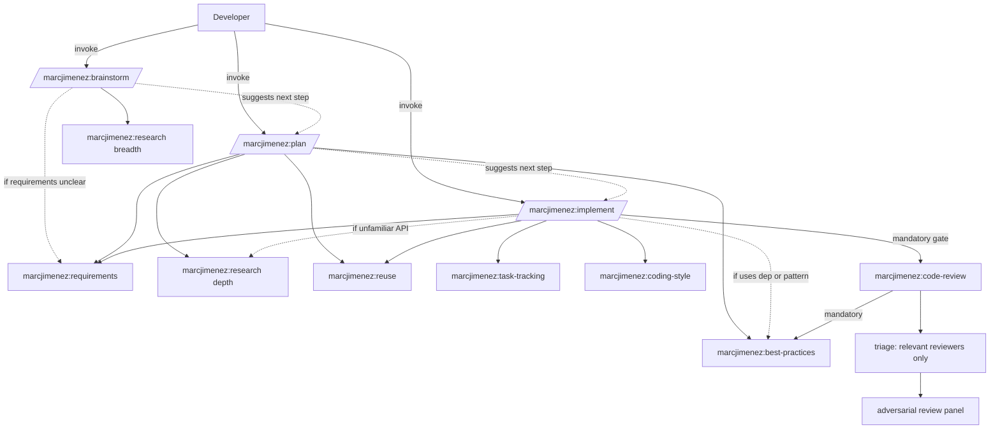

# marcjimenez Skills Plugin

A composable, opinionated development workflow for Claude Code featuring research-backed planning, code minimalism discipline, and configurable adversarial code review.

## Overview

The `marcjimenez` plugin provides a full-cycle development workflow built on a two-tier architecture:

- **Orchestrators** (user-invoked): High-level workflows that compose primitives into complete development cycles
- **Primitives** (auto-invoked): Focused discipline skills that enforce quality gates and best practices

All configuration and artifacts are stored in a cross-platform directory outside your repositories, ensuring clean separation between tooling and source code.

## Skills Reference

### Orchestrators (User-Invoked)

| Command | Purpose |
|---------|---------|
| `/marcjimenez:plan` | Produces research-backed implementation plans with concrete code examples and task breakdowns |
| `/marcjimenez:brainstorm` | Explores 2-4 solution approaches with tradeoffs before committing to a direction |
| `/marcjimenez:implement` | Executes full build cycle: branch creation, requirements gathering, task tracking, implementation, verification, code review, and PR creation |
| `/marcjimenez:setup` | Configures external connections, API keys, code review depth, VCS settings, and default preferences |

### Primitives (Auto-Invoked)

| Skill | Trigger Condition |
|-------|------------------|
| `marcjimenez:research` | Before implementing against unfamiliar APIs or libraries; gathers GitHub examples, official documentation, and best practices |
| `marcjimenez:best-practices` | During planning, implementation, and review; audits the approach against real-world GitHub patterns and flags divergences with citations |
| `marcjimenez:requirements` | When build/fix/refactor requests are vague or underspecified; grills requirements to zero ambiguity |
| `marcjimenez:reuse` | Before writing new functions, helpers, or adding dependencies; enforces the Climb-the-Ladder reuse doctrine |
| `marcjimenez:coding-style` | Before writing or editing non-trivial code; enforces ponytail minimalism and root-cause bug fixes |
| `marcjimenez:writing-for-agents` | When creating SKILL.md, CLAUDE.md, or other agent-facing documentation |
| `marcjimenez:code-review` | After completing implementation, before git push or PR creation; triages the diff to a relevant reviewer subset plus a mandatory best-practices audit |
| `marcjimenez:task-tracking` | When starting multi-step work; maintains durable task file with verifiable completion criteria |
| `marcjimenez:issue` | When creating or filing a GitHub issue; learns the repo's labeling conventions and drafts the body in its idiom |

The `implement` orchestrator hard-gates code review before any push, ensuring all changes undergo adversarial audit before leaving your local machine.

## Architecture



## Installation

### 1. Add Marketplace

Add the skills marketplace to `~/.claude/settings.json`:

```json
{
  "extraKnownMarketplaces": {
    "marcjimenez-skills": {
      "source": { "source": "github", "repo": "marcjimenez/skills" }
    }
  }
}
```

### 2. Enable Plugin

Enable per-project in `.claude/settings.json`:

```json
{
  "enabledPlugins": { "marcjimenez@marcjimenez-skills": true }
}
```

### 3. Verify Installation

Run `/skills` in Claude Code and verify that 13 `marcjimenez:*` skills appear in the list.

## Configuration

Configuration and artifacts are stored in a cross-platform directory structure outside your repositories:

**Configuration Home:**
- macOS / Linux: `${XDG_CONFIG_HOME:-$HOME/.config}/marcjimenez`
- Windows: `%APPDATA%\marcjimenez`

**Directory Structure:**
```
<config-home>/
├── global/
│   └── config.json              # Global default settings (written by /marcjimenez:setup)
├── repos/
│   └── <repo-key>/
│       ├── config.json          # Per-repository overrides
│       └── runs/
│           └── <feature-slug>/
│               ├── research.md  # Research findings
│               ├── plan.md      # Implementation plan
│               └── todo.md      # Task tracking file
└── secrets.env                  # API keys (chmod 600, never committed)
```

**Configuration Precedence:**
Inline arguments → Per-repository config → Global config → Built-in defaults

### Initial Setup

Run `/marcjimenez:setup` to configure:

- **External Connections:** Enable/disable Context7, WebSearch, WebFetch, and GitHub CLI with API key management
- **Code Review:** Adaptive by default (triage selects the reviewers each diff warrants from all eight); optionally narrow the candidate set or disable triage
- **VCS Settings:** Configure base branch, auto-assign reviewers, and branch prefixes
- **Default Preferences:** Set default code minimalism intensity

**Note:** No MCP server required. Context7 is accessed via its REST API using `CONTEXT7_API_KEY`. All other integrations use Claude's built-in tools or the `gh` CLI.

Code review works out of the box with no configuration: the triage pass adapts to each diff automatically.

**Configuration Schema:**
- Full schema: `plugins/marcjimenez/skills/setup/reference/CONFIG-SCHEMA.md`
- Code review fields: `plugins/marcjimenez/skills/code-review/reference/REVIEW-DEPTH.md`

## Validation

Validate the plugin structure (manifests, frontmatter, skill references):

```bash
bash scripts/validate.sh
```

This checks that manifests parse correctly, all 13 skills have valid frontmatter, all `/marcjimenez:*` references resolve, and there are no stale references.

## Plugin Structure

Each skill is stored as a folder directly under `plugins/marcjimenez/skills/<name>/` (the marketplace plugin loader discovers skills one level deep, so no nested category folders are used).

## Key Features

### Research-Backed Planning
The `research` primitive gathers evidence before code is written: existing repository utilities, GitHub implementation examples, official documentation via Context7, best practices, and known pitfalls.

### Ponytail Minimalism
The `coding-style` primitive enforces a lazy senior developer approach where the best code is the code never written. Emphasizes deletion over addition, boring over clever, and the shortest working diff.

### Climb-the-Ladder Reuse Doctrine
The `reuse` primitive prevents reinvention by enforcing a hierarchy: YAGNI → existing repository code → standard library → framework features → installed dependencies → one-liner → minimum new code.

### Adversarial Code Review
The `code-review` primitive runs multi-reviewer audits on local diffs before any push. A triage pass reads the diff and runs only the reviewers it warrants from the full set of eight (a docs fix skips the security reviewer; an auth change keeps it). Reviewers are explicitly adversarial, assuming code is broken until proven otherwise.

### Best-Practices Auditing
The `best-practices` primitive judges an approach against how well-regarded GitHub projects and official docs actually do the same thing, reporting each divergence with a SHA-pinned citation and a concrete fix. It runs during planning and implementation as advisory guidance, and as a mandatory blocking pass in code review where every finding must be resolved or explicitly waived.

### Hard Gates
Critical quality checks (requirements clarity, code review) are mandatory gates that cannot be bypassed. Code review runs on the local diff and must pass before any git push or PR creation.

### Durable Task Tracking
The `task-tracking` primitive maintains a task file outside the repository with concrete verification criteria for each task. Work is not considered complete until every checkbox is marked.

## Author

**Marc Jimenez**  
Email: marc@marcjimenez.dev  
Repository: [github.com/marcjimenez/skills](https://github.com/marcjimenez/skills)

## License

MIT
