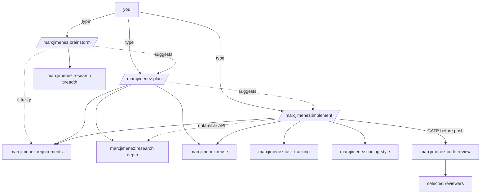

# Skills

Personal Claude Code skills marketplace for Marc Jimenez.

## `marcjimenez`

An opinionated full-cycle development workflow as composable skills, in the Matt-Pocock style:
**user-invoked orchestrators** compose **model-invoked discipline primitives**. Research-backed planning,
minimalism discipline, and a configurable adversarial code-review panel — with config persisted to a
cross-platform directory (never written into your repos).

### Skills

| Command | Role | Invocation | What it does |
|---------|------|-----------|--------------|
| `/marcjimenez:plan` | Orchestrator | you type it | Research-backed plan with concrete code examples + a task seed |
| `/marcjimenez:brainstorm` | Orchestrator | you type it | 2–4 approaches with tradeoffs before committing |
| `/marcjimenez:implement` | Orchestrator | you type it | Full build cycle: branch → requirements → tasks → build → verify → review → PR |
| `/marcjimenez:setup` | Configurator | you type it | Configure connections + API keys, review depth, VCS/PR, and defaults |
| `marcjimenez:research` | Primitive | auto | GitHub examples, Context7/WebFetch docs, best practices, reuse hunt |
| `marcjimenez:requirements` | Primitive | auto | Grill a request to zero ambiguity; gate on confirmation |
| `marcjimenez:reuse` | Primitive | auto | Climb-the-Ladder reuse doctrine before any new code or dependency |
| `marcjimenez:coding-style` | Primitive | auto | House style: ponytail minimalism, guardrails, root-cause bug fixes |
| `marcjimenez:writing-for-agents` | Primitive | auto | House style for skills / CLAUDE.md / agent-facing prose |
| `marcjimenez:code-review` | Primitive | auto | Configurable adversarial multi-reviewer audit on the local diff |
| `marcjimenez:task-tracking` | Primitive | auto | Durable task file; not done until every box is `[x]` |

Orchestrators are user-invoked (typed) and compose the primitives; primitives also auto-fire on matching
work. `implement` hard-gates `marcjimenez:code-review` before any push.

Each skill is a folder directly under `plugins/marcjimenez/skills/<name>/` (the marketplace plugin loader
discovers skills one level deep, so no category subfolders).

### Call graph



## Install

Add the marketplace to `~/.claude/settings.json`:

```json
{
  "extraKnownMarketplaces": {
    "marcjimenez-skills": {
      "source": { "source": "github", "repo": "marcjimenez/skills" }
    }
  }
}
```

Enable per-project in `.claude/settings.json`:

```json
{
  "enabledPlugins": { "marcjimenez@marcjimenez-skills": true }
}
```

## Configuration

Review depth and defaults live in a cross-platform config dir — **never inside your repositories**:

- macOS / Linux: `${XDG_CONFIG_HOME:-$HOME/.config}/marcjimenez`
- Windows: `%APPDATA%\marcjimenez`

```
<marcjimenez-home>/global/config.json            # global default (written on first run)
<marcjimenez-home>/repos/<repo-key>/config.json  # per-repo override (wins over global)
<marcjimenez-home>/repos/<repo-key>/runs/<slug>/ # durable artifacts: research.md, plan.md, todo.md
<marcjimenez-home>/secrets.env                    # API keys, chmod 600, sourced by skills (never committed)
```

Precedence: inline args → per-repo config → global config → built-in defaults.

Run `/marcjimenez:setup` to configure (or reconfigure) it all: **external connections** (Context7, WebSearch,
WebFetch, `gh`) with on/off toggles and API keys for keyed ones (keys go in `secrets.env`, never in
`config.json` or the repo); **code-review depth** (`quick`/`standard`/`paranoid`/`custom`); **VCS/PR
settings** (base branch, auto-assign reviewer, branch prefixes); and the **default minimalism intensity**.
No MCP server is required — Context7 is reached over its `curl`-able REST API with a `CONTEXT7_API_KEY`; the
rest are Claude's built-in tools or `gh`. The first time `marcjimenez:code-review` runs with no config, it asks
once for a depth tier and saves it. Full schema:
`plugins/marcjimenez/skills/setup/reference/CONFIG-SCHEMA.md` (code-review fields:
`plugins/marcjimenez/skills/code-review/reference/REVIEW-DEPTH.md`).

## Verify

After enabling, confirm the plugin loaded: run `/skills` and check the 11 `marcjimenez:*` entries appear (the
user-invoked ones — `marcjimenez:plan`, `marcjimenez:brainstorm`, `marcjimenez:implement`, `marcjimenez:setup` — are typed; the rest
auto-fire).

To check the plugin's structure (manifests parse, 11 skills with valid frontmatter, all `/marcjimenez:*`
references resolve, no stale references):

```bash
bash scripts/validate.sh
```
